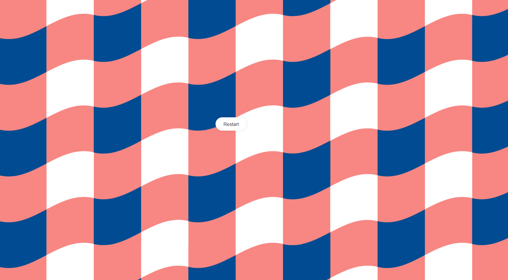

#🎌 Guess the Flag Game (Express.js + PostgreSQL + EJS)
---
This is a fun Guess the Flag game built with Express.js, PostgreSQL, and EJS.
Users can test their knowledge of world flags by trying to match a flag with the correct country.
The game demonstrates server-side rendering, database integration, and interactive user input.
Screenshots below showcase the main pages and gameplay.
---
## 📷 Gallery

| Guess the Flag |Guess the Flag |
|--------|--------|
|  |  |


---

# 1️⃣ Create Table in PostgreSQL
```sql
CREATE TABLE capitals1 (
    id SERIAL PRIMARY KEY,
    country VARCHAR(45),
    capital VARCHAR(45)
);
```
2️⃣ Install Dependencies
```bash
npm i
npm i pg express ejs body-parser
```

3️⃣ Database Connection (index.js)
```bash
const app = express()
const db = new pg.Client({
  user: "postgres",
  host: "localhost",
  database: "XXXXX",    // <-- your database name
  password: "XXXXX",    // <-- your password
  port: XXXX,           // <-- your port name
});

4️⃣ Run Server
```bash
node index.js
```
---
👉 [Open App on Localhost](http://localhost:3000)
